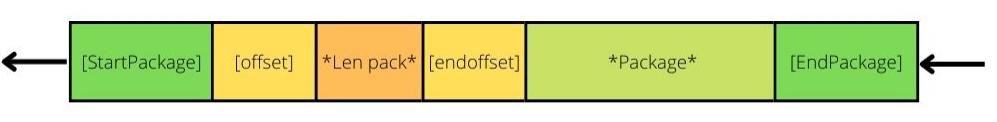

# GoNetReader
## NetReader for net.Conn

### Example:
#### Read:
```
func ConnectionRouter(Connection net.Conn) {
  reader := GoNetReader.NewNetReader()
  for {
    Pack, ErrRead := reader.NetRead(Connection)
      if ErrRead != nil {
        continue 
      }
    //  ...
  }
  // ...
}
```  
#### Write:
``` 
func Sender(Connection net.Conn) { 
  // ...
  _, connecterr := Connection.Write(GetPackage(pack))
  // ...
}

```  
### Scheme:

